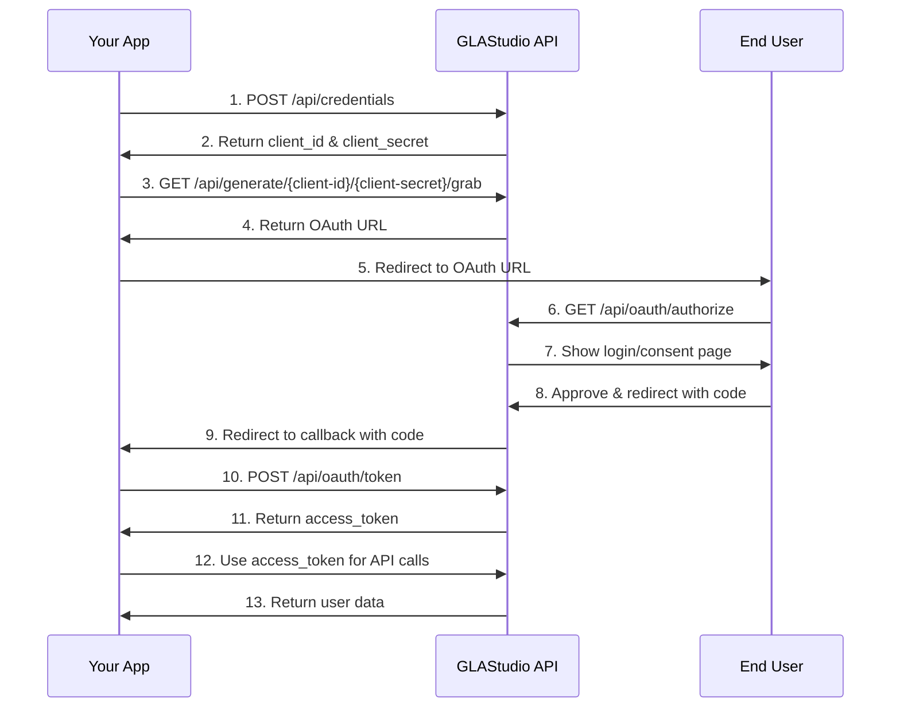

# 🔐 GLAStudio OAuth API Documentation

A comprehensive guide for developers and users to integrate with the GLAStudio OAuth 2.0 authentication system.

## 📋 Table of Contents

- [Overview](#overview)
- [Quick Start](#quick-start)
- [API Endpoints](#api-endpoints)
- [Developer Guide](#developer-guide)
- [User Guide](#user-guide)
- [OAuth Flow](#oauth-flow)
- [Security](#security)
- [Error Handling](#error-handling)
- [Rate Limiting](#rate-limiting)

## 🌟 Overview

The GLAStudio OAuth API provides secure authentication services with a two-sided approach:

- **Developer Side**: Create and manage OAuth applications, view credentials, and monitor user connections
- **User Side**: View connected apps, manage permissions, and control data access

### Key Features

- ✅ OAuth 2.0 compliant authentication
- ✅ Secure token-based API access
- ✅ User consent and permission management
- ✅ Real-time usage analytics
- ✅ Rate limiting and security monitoring
- ✅ Encrypted session management

## 🚀 Quick Start

### For Developers

1. **Create API Credentials**
   ```bash
   curl -X POST https://yourdomain.com/api/credentials \
     -H "Content-Type: application/json" \
     -d '{
       "appName": "MyCoolApp",
       "redirectUri": "https://mycoolapp.com/callback"
     }'
   ```

2. **Generate OAuth URL**
   ```bash
   curl "https://yourdomain.com/api/generate/{client-id}/{client-secret}/grab"
   ```

3. **Handle OAuth Flow**
   - Redirect users to the generated OAuth URL
   - Handle the authorization callback
   - Exchange code for access token

### For Users

1. **View Connected Apps**
   ```bash
   curl -H "Authorization: Bearer {accessToken}" \
     https://yourdomain.com/api/user/apps
   ```

2. **Manage Permissions**
   - Revoke app access when needed
   - View app permissions and data usage

## 🔗 API Endpoints

### OAuth Flow Endpoints

| Endpoint | Method | Description |
|---------|--------|-------------|
| `/api/generate/{client-id}/{client-secret}/grab` | `GET` | Generates OAuth URL for user login |
| `/api/oauth/authorize` | `GET` | Handles user login and consent |
| `/api/oauth/token` | `POST` | Exchanges authorization code for access token |
| `/api/oauth2/token?{encryptedUserId}` | `GET` | Redirect URL for user after login |

### Developer API

| Endpoint | Method | Description |
|---------|--------|-------------|
| `/api/credentials` | `POST` | Create new app credentials |
| `/api/keys/{userId}` | `GET` | View and manage API keys |
| `/api/apps/{clientId}` | `GET` | View app details and connected users |

### User API

| Endpoint | Method | Description |
|---------|--------|-------------|
| `/api/user/apps` | `GET` | List authorized apps |
| `/api/user/revoke/{appId}` | `DELETE` | Revoke app access |
| `/api/user/profile` | `GET` | View user profile |

## 👨‍💻 Developer Guide

### 1. Register Your Application

First, create API credentials for your application:

```http
POST /api/credentials
Content-Type: application/json

{
  "appName": "MyCoolApp",
  "description": "A cool application that uses OAuth",
  "redirectUri": "https://mycoolapp.com/callback",
  "scopes": ["profile", "email"]
}
```

**Response:**
```json
{
  "success": true,
  "data": {
    "clientId": "abc123def456",
    "clientSecret": "xyz789uvw012",
    "appId": "app_123456",
    "redirectUri": "https://mycoolapp.com/callback"
  },
  "message": "API credentials created successfully"
}
```

### 2. Generate OAuth URL

Use your credentials to generate an OAuth URL:

```http
GET /api/generate/{client-id}/{client-secret}/grab?redirect_uri=https://mycoolapp.com/callback&scope=profile email&state=random123
```

**Response:**
```json
{
  "success": true,
  "data": {
    "oauth_url": "https://yourdomain.com/api/oauth/authorize?client_id=abc123def456&redirect_uri=https://mycoolapp.com/callback&scope=profile email&state=random123",
    "client_id": "abc123def456",
    "redirect_uri": "https://mycoolapp.com/callback",
    "scope": "profile email",
    "state": "random123",
    "expires_in": 3600,
    "api_name": "MyCoolApp",
    "api_description": "A cool application that uses OAuth"
  },
  "message": "OAuth URL generated successfully"
}
```

### 3. Handle OAuth Flow

#### Step 1: Redirect User to OAuth URL
```javascript
// Redirect user to the generated OAuth URL
window.location.href = oauthUrl;
```

#### Step 2: Handle Authorization Callback
The user will be redirected back to your `redirect_uri` with an authorization code:

```
https://mycoolapp.com/callback?code=AUTHORIZATION_CODE&state=random123
```

#### Step 3: Exchange Code for Token
```http
POST /api/oauth/token
Content-Type: application/json

{
  "code": "AUTHORIZATION_CODE",
  "clientId": "abc123def456",
  "clientSecret": "xyz789uvw012",
  "redirectUri": "https://mycoolapp.com/callback"
}
```

**Response:**
```json
{
  "success": true,
  "data": {
    "accessToken": "access_token_value",
    "refreshToken": "refresh_token_value",
    "expiresIn": 3600,
    "tokenType": "Bearer",
    "scope": "profile email"
  },
  "message": "Token exchange successful"
}
```

### 4. Use Access Token

Make authenticated requests using the access token:

```http
GET /api/user/profile
Authorization: Bearer access_token_value
```

**Response:**
```json
{
  "success": true,
  "data": {
    "userId": "user_123",
    "username": "john_doe",
    "email": "john@example.com",
    "avatar": "https://example.com/avatar.jpg",
    "name": "John Doe"
  },
  "message": "Profile retrieved successfully"
}
```

### 5. View App Analytics

Monitor your app's usage and connected users:

```http
GET /api/apps/{clientId}
Authorization: Bearer {your_access_token}
```

**Response:**
```json
{
  "success": true,
  "data": {
    "appId": "app_123456",
    "appName": "MyCoolApp",
    "clientId": "abc123def456",
    "redirectUri": "https://mycoolapp.com/callback",
    "connectedUsers": [
      {
        "userId": "user_123",
        "username": "john_doe",
        "email": "john@example.com",
        "avatar": "https://example.com/avatar.jpg",
        "connectedAt": "2024-01-15T10:30:00Z",
        "lastAccess": "2024-01-20T14:45:00Z"
      }
    ],
    "usageStats": {
      "totalRequests": 1250,
      "successfulRequests": 1200,
      "failedRequests": 50,
      "lastRequest": "2024-01-20T14:45:00Z"
    }
  },
  "message": "App details retrieved successfully"
}
```

## 👤 User Guide

### View Connected Applications

See all applications that have access to your account:

```http
GET /api/user/apps
Authorization: Bearer {access_token}
```

**Response:**
```json
{
  "success": true,
  "data": [
    {
      "appId": "app_123456",
      "appName": "MyCoolApp",
      "appDescription": "A cool application that uses OAuth",
      "appAvatar": "https://mycoolapp.com/logo.png",
      "connectedAt": "2024-01-15T10:30:00Z",
      "lastAccess": "2024-01-20T14:45:00Z",
      "permissions": ["profile", "email"],
      "isActive": true
    }
  ],
  "message": "Connected apps retrieved successfully"
}
```

### Revoke Application Access

Remove access for a specific application:

```http
DELETE /api/user/revoke/{appId}
Authorization: Bearer {access_token}
```

**Response:**
```json
{
  "success": true,
  "data": {
    "appId": "app_123456",
    "appName": "MyCoolApp",
    "revokedAt": "2024-01-20T15:00:00Z"
  },
  "message": "App access revoked successfully"
}
```

### View Your Profile

Get your user profile information:

```http
GET /api/user/profile
Authorization: Bearer {access_token}
```

**Response:**
```json
{
  "success": true,
  "data": {
    "userId": "user_123",
    "username": "john_doe",
    "email": "john@example.com",
    "avatar": "https://example.com/avatar.jpg",
    "name": "John Doe",
    "createdAt": "2024-01-01T00:00:00Z",
    "lastLogin": "2024-01-20T14:45:00Z"
  },
  "message": "Profile retrieved successfully"
}
```

## 🔄 OAuth Flow

### Complete OAuth 2.0 Flow



### URL Structure for OAuth2 Token

The OAuth2 token URL follows this encrypted pattern:

```
/api/oauth2/token?{128-char-encrypted-userid}/{6-char-encrypted-id}/verify?={website-url}/{request-id}/{user-id}/{expiry-timestamp}
```

**Components:**
- `{128-char-encrypted-userid}`: User ID encrypted 128 characters
- `{6-char-encrypted-id}`: Random ID encrypted 10 times, 6 characters
- `{website-url}`: Registered redirect URI
- `{request-id}`: Unique request identifier
- `{user-id}`: Numeric user ID
- `{expiry-timestamp}`: Expiration timestamp

## 🔒 Security

### Authentication

- **OAuth 2.0**: Standard OAuth 2.0 flow with authorization codes
- **Bearer Tokens**: Access tokens for API authentication
- **Refresh Tokens**: Long-lived tokens for token renewal
- **Session Encryption**: AES encryption for session data

### Rate Limiting

- **Per IP**: 100 requests per minute
- **Per User**: 1000 requests per hour
- **Per App**: 5000 requests per day
- **OAuth Endpoints**: 10 requests per minute

### Data Protection

- **HTTPS Only**: All API calls must use HTTPS
- **Token Expiration**: Access tokens expire in 1 hour
- **Secure Cookies**: HttpOnly, Secure, SameSite cookies
- **Input Validation**: All inputs are validated and sanitized

## ⚠️ Error Handling

### Common Error Responses

```json
{
  "success": false,
  "error": {
    "code": "INVALID_CREDENTIALS",
    "message": "Invalid client ID or secret",
    "details": "The provided credentials are not valid"
  }
}
```

### Error Codes

| Code | Description | HTTP Status |
|------|-------------|-------------|
| `INVALID_CREDENTIALS` | Invalid client ID or secret | 401 |
| `RATE_LIMIT_EXCEEDED` | Too many requests | 429 |
| `INVALID_REDIRECT_URI` | Redirect URI mismatch | 400 |
| `EXPIRED_CODE` | Authorization code expired | 400 |
| `INVALID_TOKEN` | Invalid or expired token | 401 |
| `INSUFFICIENT_SCOPE` | Token lacks required scope | 403 |

### Handling Errors

```javascript
try {
  const response = await fetch('/api/oauth/token', {
    method: 'POST',
    headers: { 'Content-Type': 'application/json' },
    body: JSON.stringify(tokenData)
  });
  
  const data = await response.json();
  
  if (!data.success) {
    console.error('OAuth Error:', data.error.message);
    // Handle specific error types
    switch (data.error.code) {
      case 'INVALID_CREDENTIALS':
        // Re-authenticate user
        break;
      case 'RATE_LIMIT_EXCEEDED':
        // Wait and retry
        break;
    }
  }
} catch (error) {
  console.error('Network Error:', error);
}
```

## 📊 Rate Limiting

### Limits by Endpoint

| Endpoint | Rate Limit | Window |
|----------|------------|--------|
| `/api/credentials` | 10 requests | Per hour |
| `/api/generate/*/grab` | 100 requests | Per minute |
| `/api/oauth/authorize` | 10 requests | Per minute |
| `/api/oauth/token` | 50 requests | Per minute |
| `/api/user/*` | 1000 requests | Per hour |

### Rate Limit Headers

```http
X-RateLimit-Limit: 100
X-RateLimit-Remaining: 95
X-RateLimit-Reset: 1642684800
```

### Handling Rate Limits

```javascript
if (response.status === 429) {
  const resetTime = response.headers.get('X-RateLimit-Reset');
  const waitTime = (resetTime * 1000) - Date.now();
  
  setTimeout(() => {
    // Retry the request
  }, waitTime);
}
```

## 🛠️ SDK Examples

### JavaScript/Node.js

```javascript
class GLAStudioOAuth {
  constructor(clientId, clientSecret, redirectUri) {
    this.clientId = clientId;
    this.clientSecret = clientSecret;
    this.redirectUri = redirectUri;
    this.baseUrl = 'https://yourdomain.com';
  }

  async generateOAuthUrl(scope = 'profile email', state = null) {
    const url = `${this.baseUrl}/api/generate/${this.clientId}/${this.clientSecret}/grab`;
    const params = new URLSearchParams({
      redirect_uri: this.redirectUri,
      scope,
      ...(state && { state })
    });

    const response = await fetch(`${url}?${params}`);
    const data = await response.json();
    
    if (!data.success) {
      throw new Error(data.error.message);
    }
    
    return data.data.oauth_url;
  }

  async exchangeCodeForToken(code) {
    const response = await fetch(`${this.baseUrl}/api/oauth/token`, {
      method: 'POST',
      headers: { 'Content-Type': 'application/json' },
      body: JSON.stringify({
        code,
        clientId: this.clientId,
        clientSecret: this.clientSecret,
        redirectUri: this.redirectUri
      })
    });

    const data = await response.json();
    
    if (!data.success) {
      throw new Error(data.error.message);
    }
    
    return data.data;
  }

  async getUserProfile(accessToken) {
    const response = await fetch(`${this.baseUrl}/api/user/profile`, {
      headers: { 'Authorization': `Bearer ${accessToken}` }
    });

    const data = await response.json();
    
    if (!data.success) {
      throw new Error(data.error.message);
    }
    
    return data.data;
  }
}

// Usage
const oauth = new GLAStudioOAuth('client_id', 'client_secret', 'https://myapp.com/callback');

// Generate OAuth URL
const authUrl = await oauth.generateOAuthUrl();
window.location.href = authUrl;

// Handle callback
const urlParams = new URLSearchParams(window.location.search);
const code = urlParams.get('code');

if (code) {
  const tokens = await oauth.exchangeCodeForToken(code);
  const profile = await oauth.getUserProfile(tokens.accessToken);
  console.log('User profile:', profile);
}
```

### Python

```python
import requests
import json

class GLAStudioOAuth:
    def __init__(self, client_id, client_secret, redirect_uri):
        self.client_id = client_id
        self.client_secret = client_secret
        self.redirect_uri = redirect_uri
        self.base_url = 'https://yourdomain.com'

    def generate_oauth_url(self, scope='profile email', state=None):
        url = f"{self.base_url}/api/generate/{self.client_id}/{self.client_secret}/grab"
        params = {
            'redirect_uri': self.redirect_uri,
            'scope': scope
        }
        if state:
            params['state'] = state

        response = requests.get(url, params=params)
        data = response.json()

        if not data['success']:
            raise Exception(data['error']['message'])

        return data['data']['oauth_url']

    def exchange_code_for_token(self, code):
        url = f"{self.base_url}/api/oauth/token"
        data = {
            'code': code,
            'clientId': self.client_id,
            'clientSecret': self.client_secret,
            'redirectUri': self.redirect_uri
        }

        response = requests.post(url, json=data)
        response_data = response.json()

        if not response_data['success']:
            raise Exception(response_data['error']['message'])

        return response_data['data']

    def get_user_profile(self, access_token):
        url = f"{self.base_url}/api/user/profile"
        headers = {'Authorization': f'Bearer {access_token}'}

        response = requests.get(url, headers=headers)
        data = response.json()

        if not data['success']:
            raise Exception(data['error']['message'])

        return data['data']

# Usage
oauth = GLAStudioOAuth('client_id', 'client_secret', 'https://myapp.com/callback')

# Generate OAuth URL
auth_url = oauth.generate_oauth_url()
print(f"OAuth URL: {auth_url}")

# Handle callback (in your web framework)
code = request.args.get('code')
if code:
    tokens = oauth.exchange_code_for_token(code)
    profile = oauth.get_user_profile(tokens['accessToken'])
    print(f"User profile: {profile}")
```

## 📞 Support

### Getting Help

- **Documentation**: This guide covers all major features
- **API Status**: Check `/api/health` for service status
- **Rate Limits**: Monitor headers for usage limits
- **Error Codes**: Use error codes for specific issues

### Best Practices

1. **Store Tokens Securely**: Never expose client secrets in client-side code
2. **Handle Errors Gracefully**: Implement proper error handling for all API calls
3. **Respect Rate Limits**: Implement exponential backoff for retries
4. **Validate Inputs**: Always validate user inputs before sending to API
5. **Use HTTPS**: Always use HTTPS in production
6. **Monitor Usage**: Track API usage and implement alerts for unusual patterns

---

**Last Updated**: January 2024  
**API Version**: v1.0  
**Base URL**: `https://yourdomain.com`