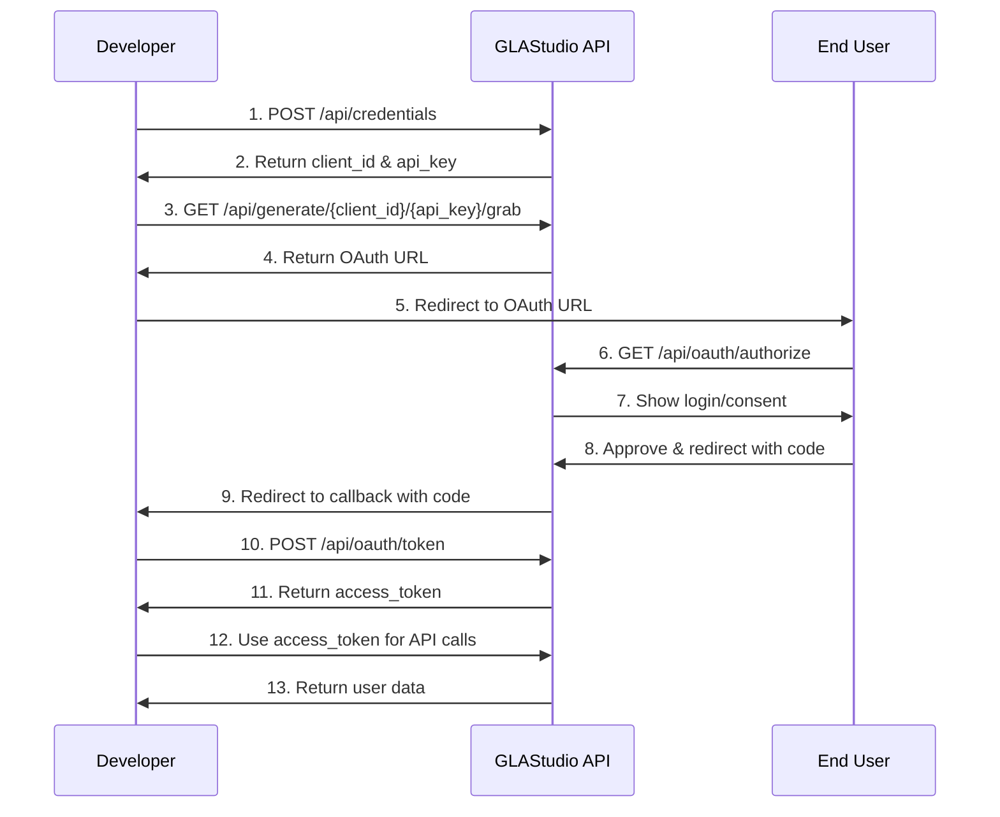

# 📚 Quick Reference Guide

A concise reference for GLAStudio OAuth API endpoints, parameters, and common usage patterns.

## 🔗 API Endpoints Overview

### OAuth Flow Endpoints

| Endpoint | Method | Purpose | Parameters |
|----------|--------|---------|------------|
| `/api/generate/{id}/{apiKey}/grab` | `GET` | Generate OAuth URL | `redirect_uri`, `scope`, `state` |
| `/api/oauth/authorize` | `GET` | User authorization | `client_id`, `redirect_uri`, `scope`, `state` |
| `/api/oauth/token` | `POST` | Exchange code for token | `code`, `client_id`, `client_secret`, `redirect_uri` |
| `/api/oauth2/token?{encrypted}` | `GET` | Redirect after login | Encrypted parameters |

### Developer API

| Endpoint | Method | Purpose | Authentication |
|----------|--------|---------|----------------|
| `/api/credentials` | `POST` | Create app credentials | User session |
| `/api/keys/{userId}` | `GET` | View API keys | User session |
| `/api/apps/{clientId}` | `GET` | View app details | Bearer token |

### User API

| Endpoint | Method | Purpose | Authentication |
|----------|--------|---------|----------------|
| `/api/user/apps` | `GET` | List connected apps | Bearer token |
| `/api/user/revoke/{appId}` | `DELETE` | Revoke app access | Bearer token |
| `/api/user/profile` | `GET` | Get user profile | Bearer token |

## 🚀 Quick Start Examples

### 1. Create OAuth App (Developer)

```bash
curl -X POST https://yourdomain.com/api/credentials \
  -H "Content-Type: application/json" \
  -H "Authorization: Bearer YOUR_SESSION_TOKEN" \
  -d '{
    "appName": "MyApp",
    "description": "My OAuth Application",
    "redirectUri": "https://myapp.com/callback",
    "scopes": ["profile", "email"]
  }'
```

**Response:**
```json
{
  "success": true,
  "data": {
    "clientId": "abc123def456",
    "clientSecret": "xyz789uvw012",
    "apiKey": "pub_123456",
    "appId": "app_123456"
  }
}
```

### 2. Generate OAuth URL (Developer)

```bash
curl "https://yourdomain.com/api/generate/abc123def456/pub_123456/grab?redirect_uri=https://myapp.com/callback&scope=profile email&state=random123"
```

**Response:**
```json
{
  "success": true,
  "data": {
    "oauth_url": "https://yourdomain.com/api/oauth/authorize?client_id=abc123def456&redirect_uri=https://myapp.com/callback&scope=profile email&state=random123",
    "expires_in": 3600
  }
}
```

### 3. Exchange Code for Token (Developer)

```bash
curl -X POST https://yourdomain.com/api/oauth/token \
  -H "Content-Type: application/json" \
  -d '{
    "code": "AUTHORIZATION_CODE",
    "clientId": "abc123def456",
    "clientSecret": "xyz789uvw012",
    "redirectUri": "https://myapp.com/callback"
  }'
```

**Response:**
```json
{
  "success": true,
  "data": {
    "accessToken": "access_token_value",
    "refreshToken": "refresh_token_value",
    "expiresIn": 3600,
    "tokenType": "Bearer"
  }
}
```

### 4. Get User Profile (Developer)

```bash
curl -H "Authorization: Bearer access_token_value" \
  https://yourdomain.com/api/user/profile
```

**Response:**
```json
{
  "success": true,
  "data": {
    "userId": "user_123",
    "username": "john_doe",
    "email": "john@example.com",
    "avatar": "https://example.com/avatar.jpg",
    "name": "John Doe"
  }
}
```

### 5. View Connected Apps (User)

```bash
curl -H "Authorization: Bearer access_token_value" \
  https://yourdomain.com/api/user/apps
```

**Response:**
```json
{
  "success": true,
  "data": [
    {
      "appId": "app_123456",
      "appName": "MyApp",
      "appDescription": "My OAuth Application",
      "connectedAt": "2024-01-15T10:30:00Z",
      "permissions": ["profile", "email"]
    }
  ]
}
```

### 6. Revoke App Access (User)

```bash
curl -X DELETE \
  -H "Authorization: Bearer access_token_value" \
  https://yourdomain.com/api/user/revoke/app_123456
```

**Response:**
```json
{
  "success": true,
  "data": {
    "appId": "app_123456",
    "appName": "MyApp",
    "revokedAt": "2024-01-20T15:00:00Z"
  }
}
```

## 📋 Common Parameters

### OAuth Parameters

| Parameter | Type | Required | Description |
|-----------|------|----------|-------------|
| `client_id` | string | Yes | Your application's client ID |
| `client_secret` | string | Yes | Your application's client secret |
| `redirect_uri` | string | Yes | Where to redirect after authorization |
| `scope` | string | No | Permissions to request (default: "profile email") |
| `state` | string | No | CSRF protection parameter |
| `response_type` | string | Yes | Always "code" for authorization code flow |

### Response Parameters

| Parameter | Type | Description |
|-----------|------|-------------|
| `success` | boolean | Whether the request was successful |
| `data` | object | Response data |
| `error` | object | Error information (if failed) |
| `message` | string | Human-readable message |

## 🔐 Authentication Methods

### 1. Session Authentication (Dashboard)
```bash
# For dashboard access
Cookie: session=YOUR_SESSION_COOKIE
```

### 2. Bearer Token (API Access)
```bash
# For API endpoints
Authorization: Bearer YOUR_ACCESS_TOKEN
```

### 3. API Key (URL Generation)
```bash
# For generating OAuth URLs
/api/generate/{clientId}/{apiKey}/grab
```

## 📊 Response Status Codes

| Status | Meaning | Common Causes |
|--------|---------|---------------|
| `200` | Success | Request completed successfully |
| `201` | Created | Resource created successfully |
| `400` | Bad Request | Invalid parameters or missing data |
| `401` | Unauthorized | Invalid credentials or missing auth |
| `403` | Forbidden | Insufficient permissions |
| `404` | Not Found | Resource doesn't exist |
| `429` | Rate Limited | Too many requests |
| `500` | Server Error | Internal server error |

## ⚠️ Common Error Codes

| Error Code | HTTP Status | Description | Solution |
|------------|-------------|-------------|----------|
| `INVALID_CREDENTIALS` | 401 | Wrong client ID/secret | Check credentials |
| `INVALID_REDIRECT_URI` | 400 | Redirect URI mismatch | Add URI to app settings |
| `EXPIRED_CODE` | 400 | Authorization code expired | Get new code |
| `RATE_LIMIT_EXCEEDED` | 429 | Too many requests | Wait and retry |
| `INVALID_TOKEN` | 401 | Token expired/invalid | Refresh token |
| `INSUFFICIENT_SCOPE` | 403 | Token lacks required scope | Request proper scopes |

## 🛠️ SDK Quick Start

### JavaScript/Node.js

```javascript
// Initialize SDK
const oauth = new GLAStudioOAuth({
  clientId: 'your_client_id',
  clientSecret: 'your_client_secret',
  redirectUri: 'https://myapp.com/callback'
});

// Generate OAuth URL
const authUrl = await oauth.generateAuthUrl();

// Handle callback
const tokens = await oauth.handleCallback(code);
const user = await oauth.getUserProfile(tokens.accessToken);
```

### Python

```python
# Initialize SDK
oauth = GLAStudioOAuth(
    client_id='your_client_id',
    client_secret='your_client_secret',
    redirect_uri='https://myapp.com/callback'
)

# Generate OAuth URL
auth_url = oauth.generate_oauth_url()

# Handle callback
tokens = oauth.exchange_code_for_token(code)
user = oauth.get_user_profile(tokens['accessToken'])
```

## 📈 Rate Limits

| Endpoint | Limit | Window | Headers |
|----------|-------|--------|---------|
| `/api/credentials` | 10 | Per hour | `X-RateLimit-*` |
| `/api/generate/*/grab` | 100 | Per minute | `X-RateLimit-*` |
| `/api/oauth/authorize` | 10 | Per minute | `X-RateLimit-*` |
| `/api/oauth/token` | 50 | Per minute | `X-RateLimit-*` |
| `/api/user/*` | 1000 | Per hour | `X-RateLimit-*` |

### Rate Limit Headers
```http
X-RateLimit-Limit: 100
X-RateLimit-Remaining: 95
X-RateLimit-Reset: 1642684800
```

## 🔄 OAuth Flow Summary



## 📞 Support Quick Links

### Documentation
- [Full API Documentation](./OAUTH_API_DOCUMENTATION.md)
- [Developer Dashboard Guide](./DEVELOPER_DASHBOARD_GUIDE.md)
- [User Guide](./USER_GUIDE.md)

### Tools
- **API Explorer**: `https://yourdomain.com/api-test`
- **Status Page**: `https://status.glasstudio.com`
- **SDK Downloads**: `https://github.com/glasstudio/oauth-sdk`

### Contact
- **Email**: developers@glasstudio.com
- **Discord**: [Join Community](https://discord.gg/glasstudio)
- **GitHub**: [Report Issues](https://github.com/glasstudio/oauth/issues)

---

**Last Updated**: January 2024  
**Quick Reference Version**: v1.0  
**API Version**: v1.0